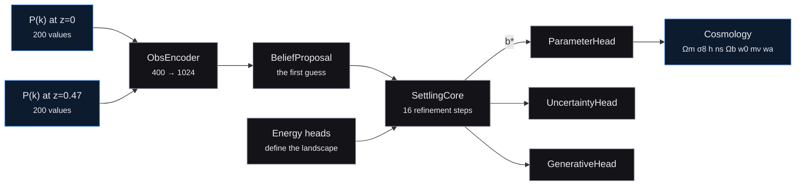
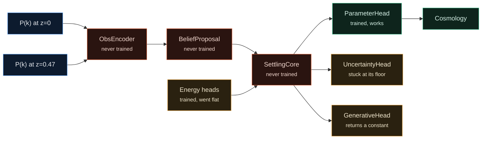

# CosmUFR

**From a sky measurement to a cosmology, in a quarter of a second.**

CosmUFR reads the matter power spectrum at two redshifts and returns eight
cosmological parameters in a single forward pass. No simulator in the loop, no
likelihood, no chain to converge.

> **Live demo:** https://aadityarajgor27--cosmufr-demo-serve.modal.run
> **Weights:** https://huggingface.co/arajgor1/cosmufr-run4

---

## Why this exists

A telescope survey measures where hundreds of millions of galaxies are. Turning
that into a statement about the universe means running the physics backwards,
and that inversion is the slow part.

The conventional route is guess, simulate, compare, repeat. Hundreds of
thousands of times, until the guesses converge. It is reliable and it costs
CPU-days to CPU-weeks per analysis.

The alternative this project tests: train a network on millions of simulated
universes until it learns the inverse directly, then a new measurement is one
forward pass. If that works, analyses currently priced out by compute become
routine.

This release is an early, working, and openly flawed attempt at that. Everything
below is measured rather than claimed, the test data ships with the code, and
the parts that do not work are named.

---

## How it works



Four hundred numbers go in. The encoder turns them into a 1024-dimensional
"belief" about which universe this is, sixteen refinement steps are meant to
sharpen that belief, and three read-out heads turn it into answers.

That is the design. The next section is what the trained weights actually do.

---

## The audit

I stress-tested my own model. It failed.



**The belief-settling core that gives this architecture its name never received
a gradient.** A `Linear` bias is initialised from a random draw and any
optimizer step moves it. Eighty-four of them are still bit-exactly `0.0` after
forty epochs. Verify in about seven seconds:

```python
import cosmufr
print(cosmufr.weight_audit(cosmufr.load_model()).table())
```

The cause is visible in released source, no checkpoint needed.
`SettlingCore.forward` detaches the belief on entry to every step:

```python
for step in range(k):
    b = b.detach()                      # <- severs everything upstream
    with torch.enable_grad():
        b_g = b.requires_grad_(True)
        E = energy_fn(b_g, z.detach(), b_prev.detach())
        grad = torch.autograd.grad(E.sum(), b_g)[0]
    b = b - eta * P * grad.detach()
```

**And a second cause, which is worse.** The energy heads *did* train, through
their own optimizer, and converged on a constant. Energy varies by about one
part in seven million across completely different spectra, and its gradient has
norm 0.11 against a belief of norm 16.5. Repairing the gradient path alone would
not make settling work: there would still be no landscape to descend. That is a
harder problem than the one I first reported, and I do not have a fix for it.

Independently confirmed by diffing Run 2's checkpoint against Run 4's, forty
epochs apart: 204 of 204 tensors in those three modules are bit-identical, while
the read-out heads moved 66 to 79 percent.

---

## Results

Measured with the released package on a deterministic split of 162,795 held-out
spectra across 16 simulation suites. Full report in
[`reports/honest_eval.json`](reports/honest_eval.json).

| Parameter | All test data | Where it varies | Bundled benchmark | Verdict |
|---|---|---|---|---|
| Ω_m | 0.717 | **0.720** | 0.687 | recovered |
| σ₈ | 0.756 | **0.757** | 0.738 | recovered |
| w₀ | 0.586 | **0.614** | 0.599 | recovered |
| h | 0.501 | **0.498** | 0.475 | partial |
| Ω_b | 0.364 | **0.363** | 0.353 | partial |
| n_s | 0.338 | **0.339** | 0.331 | partial |
| w_a | 0.165 | **0.185** | 0.148 | weak |
| Σm_ν | 0.407 | **0.011** | 0.410 | not recovered |

**Read the second column.** R² measures how much of the spread in the truth the
model explains. On data where a parameter is held at a fixed value there is no
spread, so the score is meaningless. "Where it varies" restricts each parameter
to the data that actually varies it. For neutrino mass that is the whole story:
it looks competent at 0.41 and is 0.011 once measured honestly.

**What reproduces.** The bundled 6,000-case benchmark ships in this repository
and regenerates its own column to about 1e-6 on any machine. The full-test
column came from a private split and cannot be checked from outside. The
benchmark lands within about 0.03 of it and narrows that gap rather than closing
it.

**Why the headline is lower than the model deserves.** One suite,
`bacco_multiz`, is 15 percent of the test set and scores zero on everything,
because its two redshift channels are identical copies and carry no growth
information. That is a data-generation defect. On suites with sound data, matter
density comes back at 0.98 to 0.99.

---

## Baseline

The first question anyone should ask about a 136M-parameter network is whether
something simple does just as well. Ridge regression on the same 400 inputs, fit
on half the benchmark, both models scored on the same held-out half:

| Parameter | Ridge, 400 features | CosmUFR, 136M | Winner |
|---|---|---|---|
| Ω_m | **0.738** | 0.716 | ridge |
| σ₈ | 0.734 | **0.777** | cosmufr |
| h | 0.417 | **0.496** | cosmufr |
| n_s | 0.205 | **0.343** | cosmufr |
| Ω_b | 0.312 | **0.353** | cosmufr |
| w₀ | −0.014 | **0.612** | cosmufr |
| Σm_ν | 0.242 | **0.423** | cosmufr |
| w_a | 0.018 | **0.170** | cosmufr |

CosmUFR is ahead on seven of eight. A plain linear fit beats it on matter
density, which is a real and slightly uncomfortable result: that parameter is
written into the height of the curve and you do not need a large network to read
it. The network earns its keep on parameters that are subtle or that the
training data barely varies.

Both caveats favour ridge, which is fit on rows from the same suites it is
tested on while CosmUFR has never seen any of these spectra. Rerun with
`python scripts/ridge_baseline.py`.

---

## Quick start

```bash
git clone https://github.com/arajgor1/cosmufr-run4
cd cosmufr-run4
pip install -e ".[demo]"
python -m cosmufr.reproduce          # downloads weights, regenerates the tables
```

```python
import cosmufr

model  = cosmufr.load_model()        # pulls best.pt from HuggingFace
bench  = cosmufr.load_benchmark()    # 6,000 held-out spectra, ships in this repo
result = cosmufr.infer(bench.pk_z0[0], bench.pk_z047[0], model=model)

print(result.params)                 # {'Om': 0.387, 's8': 0.672, ...}
# result.sigmas   is the clamp floor on every input. Not an error bar.
# result.pk_recon is a constant, not a reconstruction. See defect 4.
```

Inputs are `P(k)` on 200 log-spaced bins over k ∈ [0.1, 4.5] h/Mpc, at z=0 and
z=0.47, in (Mpc/h)³. Raw `P(k)` or `log10 P(k)` are both accepted.
[`examples/01_quickstart.ipynb`](examples/01_quickstart.ipynb) walks the whole
thing end to end.

---

## Roadmap

**Where it is today.** A working, audited baseline. 245 ms inference on a CPU,
bit-deterministic, trained on 84.5M spectra across 14 suites. Matter density and
clustering amplitude at R² 0.98 to 0.99 on sound data. A 6,000-case benchmark
and a linear baseline both published, including where the baseline wins.

**Next, and costed.** Repair the severed gradient path, guarded by the unit test
that would have caught it originally, which is free and verifiable before any
training spend. Then the harder one: fix the flat energy landscape. Give the
uncertainty head a floor it can leave. Rebalance a corpus that pins dark energy
at its fiducial value in 86 percent of samples. Then one pre-registered training
run with a pass/fail threshold set in advance, roughly $15.

**Open questions I want advice on.** Is iterative belief refinement worth
pursuing at all once the gradient path works, or does an amortized posterior
estimator get there in one pass? How much of the weakness in h, w₀ and w_a is a
real information limit of `P(k)` and how much is training coverage? Would higher
k, more redshifts, or explicit acoustic-scale features make h identifiable?

---

## Limitations

1. **The belief pipeline never trained.** Encoder, belief proposal and settling
   core sit at initialization.
2. **The energy landscape is flat.** The energy heads collapsed to an
   input-independent constant, so there is nothing to descend.
3. **Reported uncertainties are meaningless.** σ = 0.1 for six of eight
   parameters on every input. Do not use them.
4. **The P(k) reconstruction is a constant.** The generative head returns the
   same value at every scale, for every input, and for a random belief vector.
   Its reported MSE of 0.687 is the variance of `log10 P(k)` about a constant.
5. **Neutrino mass is not recovered.** R² = 0.011 where it varies.
6. **The anomaly score is not usable.** The energy subsystem diverged; `E_con`
   sits around −4.6e5, five orders of magnitude from the value quoted in earlier
   material.
7. **Two redshifts only.** Multi-redshift generalization is unvalidated and that
   corpus has a documented ordering defect.
8. **The headline table is not externally reproducible.** It was measured on a
   private split; the bundled benchmark narrows that gap to about 0.03.
9. **No ablation.** There is a linear baseline but no ablation of the
   architecture's own components.
10. **Historical cross-run comparisons in this project are untrustworthy**,
    because epoch-to-epoch R² noise of ±0.03 to 0.10 was never controlled for.

Earlier published figures for this model (Ω_m 0.907, σ₈ 0.911, h 0.604) are
superseded and should not be cited. They came from the training-time evaluator
on a validation set that was later corrected, with a checkpoint selected as best
from inside that noise.

---

## Provenance

| | |
|---|---|
| Checkpoint | `best.pt`, epoch 30, phase 4 |
| SHA256 | `5db09d4ff02316c60a43e08fa242223d3243f4f224b625798eaf385151150fc1` |
| Parameters | 136,194,617 |
| Trained | 2026-04-14, single B200, batch 4096, BF16 |
| Re-measured | 2026-09-04, released package, deterministic split |

## Repository

```
cosmufr/
  inference.py      cosmufr.infer(...)
  benchmark.py      load_benchmark(), evaluate()
  diagnostics.py    weight_audit(), settling_report(), compare_checkpoints()
  validate.py       input checking with specific errors
  figures.py        every figure, from real tensors
  diagram.py        the architecture diagram, both modes
  reproduce.py      python -m cosmufr.reproduce
benchmark/          the 6,000-case evaluation set
reports/            measured results and the ridge baseline
scripts/            ridge_baseline.py
tests/              determinism, reproducibility, gradient flow
examples/           notebook walkthrough
server.py           the live site and demo
app.py              a Gradio version, for local use
```

## Citation

```bibtex
@misc{cosmufr_run4_2026,
  title  = {CosmUFR: learned inference of cosmological parameters from the
            matter power spectrum, with an audit of its training defects},
  author = {Rajgor, Aaditya},
  year   = {2026},
  url    = {https://github.com/arajgor1/cosmufr-run4}
}
```

MIT licensed. If you work on cosmological inference and any of the open
questions above look answerable, I would like to hear from you.
